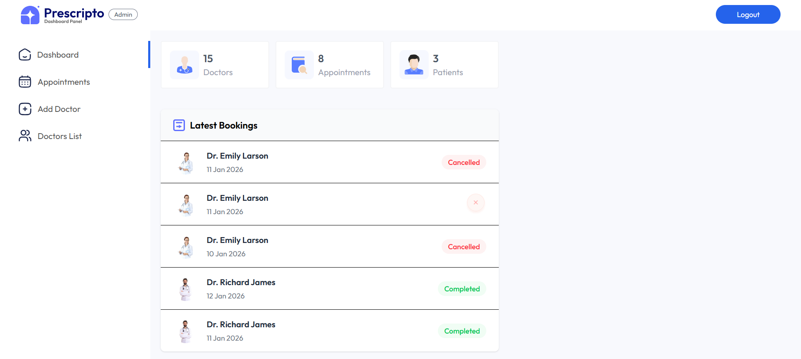
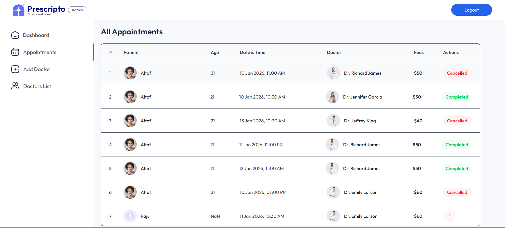

# 🩺 Prescripto - Doctor Appointment Booking System

> A modern, full-stack healthcare appointment management platform built with the MERN stack, enabling seamless doctor-patient interactions and efficient appointment scheduling.

[](https://docappointo.vercel.app/)

## 🔗 Live Demo

**🌐 Visit the live application:** [https://docappointo.vercel.app/](https://docappointo.vercel.app/)

---

## 📋 Table of Contents

- [Overview](#-overview)
- [System Architecture](#-system-architecture)
- [Tech Stack](#-tech-stack)
- [Features](#-features)
- [Authentication & Authorization](#-authentication--authorization)
- [Project Structure](#-project-structure)
- [Installation & Setup](#-installation--setup)
- [Environment Variables](#-environment-variables)
- [API Overview](#-api-overview)
- [Deployment](#-deployment)
- [Screenshots](#-screenshots)
- [Future Improvements](#-future-improvements)

---

## 🌟 Overview

**Prescripto** is a comprehensive doctor appointment booking system designed to bridge the gap between patients and healthcare providers. The platform solves the common problem of inefficient appointment scheduling by providing:

- **Patients:** Easy browsing of verified doctors, online appointment booking, and digital health record management
- **Doctors:** Streamlined appointment management, patient interaction tools, and profile customization
- **Admins:** Complete system oversight, doctor onboarding, and appointment analytics

The system features three distinct applications working in harmony: a patient-facing frontend, a doctor/admin dashboard, and a robust REST API backend.

---

## 🏗️ System Architecture

```
┌─────────────────────────────────────────────────────────────┐
│                         FRONTEND                             │
│              (React + Vite + TailwindCSS)                   │
│          Patient Portal - Browse & Book Doctors             │
└──────────────────────┬──────────────────────────────────────┘
                       │
                       │ HTTPS/REST API
                       │
┌──────────────────────┴──────────────────────────────────────┐
│                     BACKEND API                              │
│              (Node.js + Express + MongoDB)                  │
│        JWT Auth • Role-based Access • File Upload           │
└──────────────────────┬──────────────────────────────────────┘
                       │
        ┌──────────────┴──────────────┐
        │                             │
┌───────▼──────────┐        ┌─────────▼────────┐
│  MongoDB Atlas   │        │  Cloudinary CDN  │
│  (Database)      │        │  (Image Storage) │
└──────────────────┘        └──────────────────┘
                       │
                       │ HTTPS/REST API
                       │
┌──────────────────────┴──────────────────────────────────────┐
│                     ADMIN PANEL                              │
│              (React + Vite + TailwindCSS)                   │
│        Admin Dashboard - Manage Doctors & Appointments      │
└─────────────────────────────────────────────────────────────┘
```

---

## 🛠️ Tech Stack

### **Frontend (Patient Portal)**
- **React 19** - UI library
- **Vite** - Build tool and dev server
- **React Router DOM** - Client-side routing
- **Axios** - HTTP client
- **TailwindCSS** - Utility-first CSS framework
- **React Toastify** - Notifications

### **Admin Panel**
- **React 19** - UI library
- **Vite** - Build tool
- **React Router DOM** - Routing
- **Axios** - API communication
- **TailwindCSS** - Styling
- **React Toastify** - Toast notifications

### **Backend**
- **Node.js** - Runtime environment
- **Express 5** - Web framework
- **MongoDB** - NoSQL database
- **Mongoose** - ODM for MongoDB
- **JSON Web Token (JWT)** - Authentication
- **bcryptjs** - Password hashing
- **Multer** - File upload middleware
- **Cloudinary** - Image hosting and CDN
- **Razorpay** - Payment gateway integration
- **Validator** - Input validation
- **CORS** - Cross-origin resource sharing
- **dotenv** - Environment configuration

### **Deployment & Tools**
- **Vercel** - Frontend & Admin hosting
- **Render** - Backend hosting
- **MongoDB Atlas** - Cloud database
- **Git/GitHub** - Version control

---

## ✨ Features

### **👥 Patient Features**
- 🔍 Browse doctors by specialty (Dermatologist, Gastroenterologist, General physician, etc.)
- 📅 View doctor availability and book appointments
- 🔐 Secure user authentication and registration
- 👤 Manage personal profile and upload profile picture
- 📋 View appointment history and upcoming appointments
- ❌ Cancel appointments
- 💳 Razorpay payment integration for appointment fees
- 📱 Responsive design for mobile and desktop

### **👨‍⚕️ Doctor Features**
- 🔐 Doctor-specific login portal
- 📊 Personal dashboard with appointment statistics
- 📝 View and manage patient appointments
- ✅ Mark appointments as completed
- ❌ Cancel appointments
- 👔 Update profile information and availability status
- 💰 Track earnings from appointments

### **🔧 Admin Features**
- 🔐 Admin authentication system
- ➕ Add new doctors to the platform
- 📋 View and manage all doctors
- 🔄 Toggle doctor availability
- 📊 Admin dashboard with system overview
- 📅 View all appointments across the platform
- ❌ Cancel appointments on behalf of users
- 📈 Appointment analytics and insights

---

## 🔐 Authentication & Authorization

The system implements **role-based access control (RBAC)** with three distinct user roles:

### **Authentication Flow**
1. Users register/login with email and password
2. Passwords are hashed using **bcryptjs** before storage
3. Upon successful authentication, a **JWT token** is generated
4. Token is stored in localStorage (frontend) and sent with each API request
5. Backend middleware validates tokens and extracts user information

### **Role-Based Middleware**
- **`authUser.js`** - Protects patient endpoints (profile, appointments, booking)
- **`authDoctor.js`** - Protects doctor endpoints (dashboard, appointments, profile)
- **`authAdmin.js`** - Protects admin endpoints (add doctor, manage system)

### **Security Features**
- Password validation (minimum 8 characters)
- Email format validation
- JWT expiration handling
- Token-based session management
- Protected routes on both frontend and backend

---

## 📁 Project Structure

```
Docappoint/
├── frontend/                    # Patient-facing React application
│   ├── src/
│   │   ├── assets/             # Images, icons, logos
│   │   ├── components/         # Reusable UI components
│   │   │   ├── Banner.jsx
│   │   │   ├── Footer.jsx
│   │   │   ├── Header.jsx
│   │   │   ├── Navbar.jsx
│   │   │   ├── RelatedDoctors.jsx
│   │   │   ├── SpecialityMenu.jsx
│   │   │   └── TopDoctors.jsx
│   │   ├── context/            # React Context for state management
│   │   │   └── AppContext.jsx
│   │   ├── pages/              # Application pages
│   │   │   ├── About.jsx
│   │   │   ├── Appointment.jsx
│   │   │   ├── Contact.jsx
│   │   │   ├── Doctors.jsx
│   │   │   ├── Home.jsx
│   │   │   ├── Login.jsx
│   │   │   ├── MyAppointments.jsx
│   │   │   └── MyProfile.jsx
│   │   ├── App.jsx
│   │   ├── main.jsx
│   │   └── index.css
│   ├── index.html
│   ├── package.json
│   ├── tailwind.config.js
│   └── vite.config.js
│
├── admin/                       # Admin panel React application
│   ├── src/
│   │   ├── assets/             # Admin assets
│   │   ├── components/
│   │   │   ├── Navbar.jsx
│   │   │   └── Sidebar.jsx
│   │   ├── context/            # Context providers
│   │   │   ├── AdminContext.jsx
│   │   │   ├── AppContext.jsx
│   │   │   └── DoctorContext.jsx
│   │   ├── pages/
│   │   │   ├── Admin/          # Admin-specific pages
│   │   │   │   ├── AddDoctor.jsx
│   │   │   │   ├── AllAppointments.jsx
│   │   │   │   ├── Dashboard.jsx
│   │   │   │   └── DoctorsList.jsx
│   │   │   ├── Doctor/         # Doctor-specific pages
│   │   │   │   ├── DoctorAppointment.jsx
│   │   │   │   ├── DoctorDashboard.jsx
│   │   │   │   └── DoctorProfile.jsx
│   │   │   └── login.jsx
│   │   ├── App.jsx
│   │   └── main.jsx
│   ├── index.html
│   ├── package.json
│   └── tailwind.config.js
│
├── backend/                     # Node.js Express API
│   ├── config/
│   │   ├── cloudinary.js       # Cloudinary configuration
│   │   └── mongodb.js          # MongoDB connection
│   ├── controllers/            # Business logic
│   │   ├── adminController.js
│   │   ├── doctorController.js
│   │   └── userController.js
│   ├── middlewares/            # Express middleware
│   │   ├── authAdmin.js        # Admin authentication
│   │   ├── authDoctor.js       # Doctor authentication
│   │   ├── authUser.js         # User authentication
│   │   └── multer.js           # File upload handling
│   ├── models/                 # Mongoose schemas
│   │   ├── appointmentModel.js
│   │   ├── doctorModel.js
│   │   └── userModel.js
│   ├── routes/                 # API routes
│   │   ├── adminRoute.js
│   │   ├── doctorRoute.js
│   │   └── userRoute.js
│   ├── uploads/                # Temporary file storage
│   ├── server.js               # Entry point
│   └── package.json
│
└── README.md
```

---

## 🚀 Installation & Setup

### **Prerequisites**
- Node.js (v16 or higher)
- npm or yarn
- MongoDB Atlas account (or local MongoDB)
- Cloudinary account (for image uploads)
- Razorpay account (for payments)

### **1. Clone the Repository**
```bash
git clone https://github.com/Altaf-Raja07/DocAppointo.git
cd docappoint
```

### **2. Backend Setup**
```bash
cd backend
npm install
```

Create a `.env` file in the `backend` directory:
```env
MONGODB_URI=your_mongodb_connection_string
JWT_SECRET=your_jwt_secret_key
ADMIN_EMAIL=admin@docappoint.com
ADMIN_PASSWORD=your_admin_password
CLOUDINARY_NAME=your_cloudinary_name
CLOUDINARY_API_KEY=your_cloudinary_api_key
CLOUDINARY_SECRET_KEY=your_cloudinary_secret_key
RAZORPAY_KEY_ID=your_razorpay_key_id
RAZORPAY_KEY_SECRET=your_razorpay_key_secret
PORT=4000
```

Start the backend server:
```bash
npm run server    # Development mode with nodemon
# or
npm start         # Production mode
```

Backend will run on `http://localhost:4000`

### **3. Frontend Setup**
```bash
cd ../frontend
npm install
```

Create a `.env` file in the `frontend` directory:
```env
VITE_BACKEND_URL=http://localhost:4000
```

Start the frontend:
```bash
npm run dev
```

Frontend will run on `http://localhost:5173`

### **4. Admin Panel Setup**
```bash
cd ../admin
npm install
```

Create a `.env` file in the `admin` directory:
```env
VITE_BACKEND_URL=http://localhost:4000
```

Start the admin panel:
```bash
npm run dev
```

Admin panel will run on `http://localhost:5174`

---

## ⚙️ Environment Variables

### **Backend (.env)**
| Variable | Description | Required |
|----------|-------------|----------|
| `MONGODB_URI` | MongoDB connection string | ✅ |
| `JWT_SECRET` | Secret key for JWT signing | ✅ |
| `ADMIN_EMAIL` | Default admin email | ✅ |
| `ADMIN_PASSWORD` | Default admin password | ✅ |
| `CLOUDINARY_NAME` | Cloudinary cloud name | ✅ |
| `CLOUDINARY_API_KEY` | Cloudinary API key | ✅ |
| `CLOUDINARY_SECRET_KEY` | Cloudinary secret key | ✅ |
| `RAZORPAY_KEY_ID` | Razorpay key ID | ✅ |
| `RAZORPAY_KEY_SECRET` | Razorpay secret key | ✅ |
| `PORT` | Server port (default: 4000) | ❌ |

### **Frontend & Admin (.env)**
| Variable | Description | Required |
|----------|-------------|----------|
| `VITE_BACKEND_URL` | Backend API URL | ✅ |

---

## 🔌 API Overview

The backend exposes three main API route groups:

### **User Routes** (`/api/user`)
- `POST /register` - User registration
- `POST /login` - User login
- `GET /get-profile` - Get user profile (protected)
- `POST /update-profile` - Update user profile (protected)
- `POST /book-appointment` - Book an appointment (protected)
- `GET /appointments` - Get user appointments (protected)
- `POST /cancel-appointment` - Cancel appointment (protected)
- `POST /payment-razorpay` - Initiate Razorpay payment (protected)
- `POST /verify-razorpay` - Verify Razorpay payment (protected)

### **Doctor Routes** (`/api/doctor`)
- `GET /list` - Get all doctors (public)
- `POST /login` - Doctor login
- `GET /appointments` - Get doctor's appointments (protected)
- `POST /complete-appointment` - Mark appointment complete (protected)
- `POST /cancel-appointment` - Cancel appointment (protected)
- `GET /dashboard` - Get doctor dashboard data (protected)
- `GET /profile` - Get doctor profile (protected)
- `POST /update-profile` - Update doctor profile (protected)

### **Admin Routes** (`/api/admin`)
- `POST /login` - Admin login
- `POST /add-doctor` - Add new doctor (protected)
- `POST /all-doctors` - Get all doctors (protected)
- `POST /change-availability` - Toggle doctor availability (protected)
- `GET /appointments` - Get all appointments (protected)
- `POST /cancel-appointment` - Cancel appointment (protected)
- `GET /dashboard` - Get admin dashboard stats (protected)

---

## 🌐 Deployment

### **Frontend & Admin (Vercel)**
1. Push code to GitHub
2. Import project to Vercel
3. Set environment variables in Vercel dashboard
4. Deploy

### **Backend (Render)**
1. Create new Web Service on Render
2. Connect GitHub repository
3. Set build command: `npm install`
4. Set start command: `npm start`
5. Add environment variables
6. Deploy

### **Database (MongoDB Atlas)**
1. Create a cluster on MongoDB Atlas
2. Whitelist IP addresses (0.0.0.0/0 for development)
3. Create database user
4. Get connection string
5. Add to backend environment variables

---

## 📸 Screenshots






---

## 🔮 Future Improvements

- [ ] Video consultation feature
- [ ] Real-time chat between doctors and patients
- [ ] Email/SMS notifications for appointments
- [ ] Multi-language support
- [ ] Advanced search filters (location, ratings, insurance)
- [ ] Prescription management system
- [ ] Medical records upload
- [ ] Mobile app (React Native)
- [ ] Stripe payment integration
- [ ] Doctor review and rating system
- [ ] Appointment reminders
- [ ] Calendar integration (Google Calendar)
- [ ] Analytics dashboard with charts
- [ ] Export appointment reports (PDF/CSV)

---

## 🙏 Acknowledgments

- [React](https://react.dev/)
- [Vite](https://vitejs.dev/)
- [TailwindCSS](https://tailwindcss.com/)
- [MongoDB](https://www.mongodb.com/)
- [Express](https://expressjs.com/)
- [Cloudinary](https://cloudinary.com/)
- [Razorpay](https://razorpay.com/)

---

<div align="center">
  
### ⭐ If you found this project helpful, please give it a star!

Made with ❤️ by Altaf Raja

</div>
